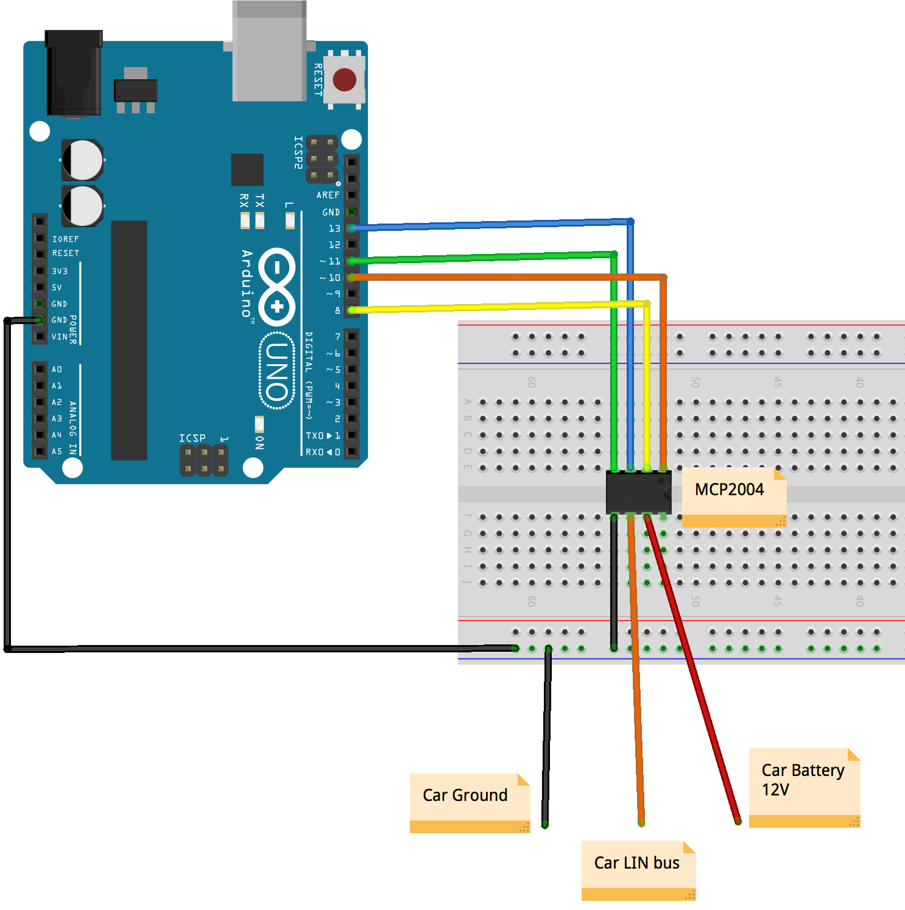
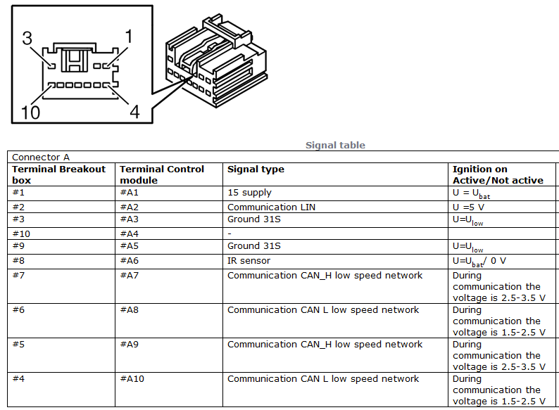
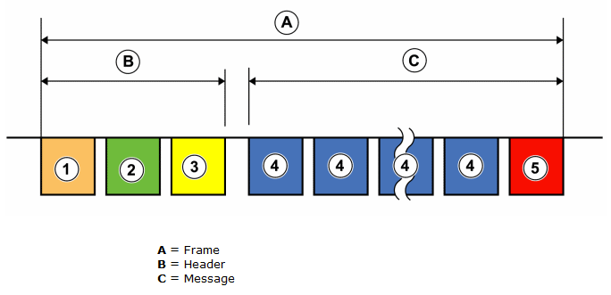

# VOLVO LIN BUS READER

Simple Arduino + MCP2004 based reader. Reads steering wheel keys via LIN bus.

Tested with **Volvo V50 2006**.

## Scheme

## Connector

Connection to LIN bus can be found behind Volvo Infotainment Control Module (ICM).

Video instructions how to remove stereo from Volvo V50 floating dash: 
[https://www.youtube.com/watch?v=Xo5NpBt04qs](https://www.youtube.com/watch?v=Xo5NpBt04qs)

## LIN Message

A message on LIN is called a frame and consist of the following parts:

1. **Synchronisation interrupt.** Used to wake slave nodes that are in sleep mode. 
Synchronisation field. The synchronisation field helps slave nodes to synchronise with their master node's clock frequency, in order for messages sent to be received correctly. 
2. **Identification field.** Contains information about the contents of the message. All nodes can read and respond to a message, yet only one node has the right to send a response to the message. Which node has the right to answer the message (send response data) is evident from the identifier. 
3. **Data information.** The data sent can be two to eight bytes long. The data information is sent with the least significant bit first. 
4. **Checksum.** The checksum is a way for slave notes to check whether the received message has been transferred correctly, or if any disturbance can have occurred during the transmission which has corrupted the data. If an error has occurred in a message during transmission from the master node to the slave node, i.e. the checksum calculated by the slave node does not correspond, the slave node will erase the message and await the next message sent from the master node. 

## Credits

Frame checksum calculation based on [Arduino LINBUS Gadgets code](https://github.com/zapta/linbus/).